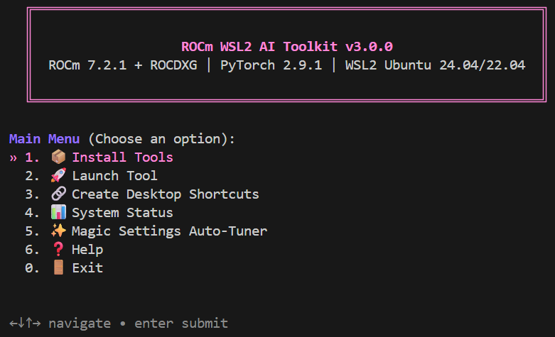
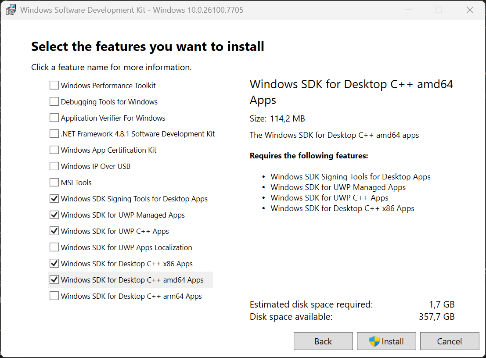

# ROCm WSL2 AI Toolkit

**The painless, automated way to run stable, high-performance AI on AMD hardware.**



## 🛑 The Problem: AMD AI on Windows is a Headache
If you've ever tried running Stable Diffusion or ComfyUI on an AMD Radeon graphics card in Windows, you know the struggle:
- **Native Windows ROCm** is often unsupported, lagging behind Linux in features, or fundamentally unstable.
- **WSL2 (Windows Subsystem for Linux)** is drastically faster and more stable, but requires complex terminal wizardry to properly pass-through the GPU and manually configure the drivers.
- **Dependency Hell**: Tracking down the exact python wheels, `HSA_OVERRIDE_GFX_VERSION` variables, and PyTorch builds that actually work together takes hours of forum searching.
- **VRAM Hostage Situations**: Forgetting to close a terminal window means Python permanently hogs your card's VRAM, completely crippling your Windows gaming or rendering performance until you hunt down the process.

## ⭐ The Solution: Make it Effortless
This toolkit was built to abstract away the Linux complexity. It provides a beautiful, keyboard-driven smart dashboard that fully automates the installation of AMD's ROCm 7.2.3 stack with ROCDXG and PyTorch 2.9.1 inside WSL2. 

**Why this makes your life easier:**
- **Zero Guesswork Installation**: It automatically queries your OS, downloads the exact AMD-official PyTorch wheels, and silos everything in an isolated virtual environment. You literally just press "Install".
- **Seamless Windows Integration**: It generates interactive `.bat` files straight to your Windows Desktop. Double-click the icon in Windows, and it silently boots the WSL backend and launches your AI tools without you ever touching a terminal.
- **💤 Smart Sleep VRAM Manager**: Your AI tools are automatically put into hibernation after 30 minutes of inactivity, instantly freeing 100% of your VRAM back to Windows! Simply refreshing your browser on port 8188 wakes the AI instantly back up.
- **✨ Magic Settings Auto-Tuner**: Unsure which PyTorch optimizations make your specific GPU fastest? The built-in tuner natively sweeps your hardware against different attention and caching profiles, isolates the mathematical winner, and permanently injects it into your launch scripts.
- **🔄 One-Click Self-Update**: The toolkit can update itself and all installed AI tools from within the menu — no manual `git pull` needed.
- **🎨 Model Training with kohya_ss**: Optionally install [kohya_ss](https://github.com/bmaltais/kohya_ss) for LoRA, DreamBooth, and fine-tuning directly on your AMD GPU.
- **Gorgeous Status Dashboard**: Built with Charmbracelet's `gum`, giving you a highly readable, colorful interface with real-time hardware polling so you never have to guess if ROCm is actually working.

---

## 🎯 Supported GPUs

- AMD Radeon RX 7000 series (RDNA3)
- AMD Radeon RX 9000 series (RDNA4)
- AMD Ryzen Strix / Strix Halo APUs (NEW in 3.0.0)
- **Note**: Only RDNA3+ (gfx1100+) GPUs and supported Ryzen APUs are supported

## 📋 Prerequisites

### Windows Requirements
- Windows 11
- [AMD Adrenalin Edition 26.2.2 **or newer**](https://www.amd.com/en/support/download/drivers.html) driver installed
- [Windows SDK](https://developer.microsoft.com/en-us/windows/downloads/windows-sdk/) installed (required for ROCDXG build)
- WSL2 enabled and configured

### WSL2 Requirements
- Ubuntu 24.04 (recommended) **or** Ubuntu 22.04
- At least 20GB free disk space
- Internet connection for downloads

---

## 🚀 Quick Start

### 0. Absolute Beginner? (Windows 1-Click Setup)
If you have absolutely no idea how to install WSL2 or Ubuntu, we wrote an automated Windows wizard for you.
Simply right-click the `Install_WSL_Ubuntu.bat` file in this repository and select **"Run as administrator"**. It will completely configure WSL2 and download Ubuntu 24.04 directly to your PC.

Once inside your new Ubuntu terminal, continue below:

### 1. Clone the Repository

```bash
git clone https://github.com/daMustermann/rocm-wsl-ai.git
cd rocm-wsl-ai
```

### 2. Run the Menu

```bash
chmod +x menu.sh
./menu.sh
```

### 3. Install Base Environment

1. From the menu, select **Install** → **Base Environment**
2. Wait for installation to complete (10-20 minutes)
3. **IMPORTANT**: Restart WSL2
   ```powershell
   # In Windows PowerShell or CMD:
   wsl --shutdown
   ```
4. Restart your Ubuntu terminal

### 4. Install AI Tools

Run `./menu.sh` again and install your desired tools:
- **ComfyUI**: Node-based workflow for Stable Diffusion
- **SD.Next**: Advanced Stable Diffusion WebUI
- **Automatic1111**: Popular Stable Diffusion WebUI
- **kohya_ss** *(optional)*: LoRA, DreamBooth & fine-tuning model training

### 5. Launch and Enjoy!

Use the **Launch Tool** menu to start your installed applications, or use the **Create Desktop Shortcuts** option to add icons directly to your Windows desktop!

---

## 🎨 Optional: kohya_ss Model Training

[kohya_ss](https://github.com/bmaltais/kohya_ss) is a powerful training framework for creating LoRA adapters, DreamBooth fine-tunes, and other model customizations. It runs fully on your AMD GPU via ROCm.

### Install kohya_ss

From the menu: **Install Tools → kohya_ss (LoRA / Model Training)**

This will:
- Clone the kohya_ss repository to `~/kohya_ss`
- Create a **dedicated** Python virtual environment (`~/kohya_env`) to avoid dependency conflicts with your inference tools
- Install PyTorch with ROCm support and all training dependencies
- Pre-configure [Hugging Face Accelerate](https://huggingface.co/docs/accelerate) for single-GPU ROCm training

### Launch kohya_ss

From the menu: **Launch Tool → kohya_ss (Training GUI)**

Or create a desktop shortcut: **Create Desktop Shortcuts → kohya_ss**

The web GUI will start at **http://localhost:7861** — open this in your Windows browser.

> **Note:** kohya_ss uses a separate venv (`~/kohya_env`) and does **not** share dependencies with your inference tools (`~/genai_env`). Your ComfyUI/SD.Next installations are unaffected.

---

## 🔄 Self-Update

The toolkit can update itself and all installed AI tools without leaving the menu.

### Update the Toolkit

From the menu: **Updates → Check for Toolkit Updates**

This will:
1. Fetch the latest commits from the remote repository
2. Show you a list of new changes
3. Apply the update with `git pull --rebase` (safe — preserves local changes via autostash)
4. Prompt you to restart `menu.sh` to apply the changes

### Update AI Tools

From the menu: **Updates → Update Installed AI Tools**

This opens the Update Manager which lets you selectively update:
- PyTorch + Triton
- ComfyUI (including all custom nodes)
- SD.Next
- Automatic1111 (including all extensions)
- kohya_ss
- Ollama
- Text Generation WebUI
- Or update everything at once

---

## ⬆️ Upgrading from v3.0.x / v3.1.x

If you already have the toolkit installed with ROCm 7.2.1, you can upgrade to 7.2.3 + ROCDXG **without losing any of your AI tools, models, or custom nodes**.

### Before You Upgrade

On your **Windows** machine, install these two things:

1. **AMD Adrenalin 26.2.2+ driver or newer** — [Download here](https://www.amd.com/en/support/download/drivers.html)
2. **Windows SDK** — [Download here](https://developer.microsoft.com/en-us/windows/downloads/windows-sdk/)
   *(During installation, check **"Windows SDK for Desktop C++ amd64 Apps"**. It will automatically select a few required dependencies—leave those checked, but you can uncheck everything else to save space).*
   
   

### Run the Upgrade

```bash
cd rocm-wsl-ai
git pull        # Get the latest toolkit version  —  or use menu: Updates → Check for Toolkit Updates
./menu.sh
# Select: Install Tools → Upgrade from ROCm 7.2.1 → 7.2.3 (ROCDXG)
```

The upgrade wizard will:
- ✅ **Back up** your old Python virtual environment (you can delete it later)
- ✅ **Install** ROCm 7.2.3 and build ROCDXG (librocdxg) from source
- ✅ **Create** a fresh venv with PyTorch 2.9.1+rocm7.2.3
- ✅ **Reinstall** all dependencies for your installed AI tools (ComfyUI, SD.Next, etc.)
- ✅ **Preserve** all your models, custom nodes, extensions, and configurations

> **Your models are SAFE.** They live in `~/ComfyUI/models/`, `~/stable-diffusion-webui/models/`, etc. — completely outside the Python environment. The upgrade never touches them.

### After the Upgrade

1. Restart WSL: `wsl --shutdown` (in PowerShell)
2. Relaunch Ubuntu and run `./menu.sh`
3. Launch your AI tools as usual — everything should work with the new ROCm 7.2.3 + ROCDXG stack

### What Changed (Technical)

| | Before (v3.0.x) | After (v3.1.0) |
|---|---|---|
| ROCm | 7.2.1 | 7.2.3 |
| WSL Bridge | Legacy roc4wsl | **ROCDXG (librocdxg)** |
| Install method | `amdgpu-install --usecase=wsl,rocm` | `apt install rocm` + librocdxg |
| Windows driver | Adrenalin 26.1.1 | **Adrenalin 26.2.2+** |
| Env var | — | `HSA_ENABLE_DXG_DETECTION=1` |
| GPU support | RDNA3+ discrete | + **Ryzen Strix/Halo APUs** |

---

## 🛠️ What Gets Installed

### Base Environment
1. **ROCm 7.2.3** via AMD's official `amdgpu-install` quick-start
2. **ROCDXG (librocdxg)** — built from source, WSL GPU compute bridge
3. **Python Virtual Environment** (`~/genai_env`) — isolated from system Python
4. **PyTorch 2.9.1** — official AMD wheels from `repo.radeon.com`
5. **GPU Configuration** — `HSA_OVERRIDE_GFX_VERSION` + `HSA_ENABLE_DXG_DETECTION`

### Optional Tools
| Tool | Description | Port | Venv |
|------|-------------|------|------|
| ComfyUI | Node-based Stable Diffusion | 8188 | `~/genai_env` |
| SD.Next | Advanced WebUI | 7860 | `~/genai_env` |
| Automatic1111 | Popular WebUI | 7860 | `~/genai_env` |
| kohya_ss | LoRA & model training | 7861 | `~/kohya_env` |

## ⚙️ Technical Details

| Component | Version / Detail |
|-----------|------------------|
| ROCm | 7.2.3 |
| ROCDXG | librocdxg (built from source) |
| PyTorch | 2.9.1+rocm7.2.3 |
| Triton | 3.5.1+rocm7.2.3 |
| kohya_ss venv | `~/kohya_env` (separate from `~/genai_env`) |
| Accelerate | pre-configured for single-GPU ROCm |

---

## 🔧 Troubleshooting

### Desktop Shortcut Doesn't Start / Window Closes Immediately
**Symptoms**: Double-clicking the `.bat` file on the Desktop opens a window that closes immediately, or WSL fails to start.

**Solutions**:
1. **Recreate the shortcut** — old shortcuts created before v3.2.0 used incorrect `wsl.exe` syntax. Delete the old `.bat` file and create a new one from the menu: **Create Desktop Shortcuts**
2. **Check WSL is installed** — run `wsl --list --verbose` in PowerShell to confirm Ubuntu is available
3. **Enable WSL interop** — run `wsl --update` in PowerShell (as Administrator)
4. **Check the WSL distro name** — the shortcut uses `$WSL_DISTRO_NAME` which is usually `Ubuntu-24.04`. Run `echo $WSL_DISTRO_NAME` inside WSL to confirm

### GPU Not Detected
**Symptoms**: `rocminfo` shows no GPU or PyTorch can't see ROCm
**Solutions**:
1. Verify AMD Adrenalin 26.2.2 or newer is installed on Windows
2. Verify `HSA_ENABLE_DXG_DETECTION=1` is set in your environment
3. Check librocdxg is installed: `ls /opt/rocm/lib/librocdxg.so`
4. Restart WSL2: `wsl --shutdown` (in PowerShell)
5. Check GPU in Windows: Open Radeon Software
6. Verify WSL2 is up to date: `wsl --update`

### PyTorch Import Error
**Symptoms**: `ImportError` when importing torch
**Solutions**:
1. Ensure virtual environment is activated:
   ```bash
   source ~/genai_env/bin/activate
   ```
2. Reinstall base environment from menu

## 📄 License

MIT License

## 🙏 Acknowledgments

- AMD for ROCm and driver support
- PyTorch team for ROCm integration
- [bmaltais](https://github.com/bmaltais) for the excellent kohya_ss training framework
- The incredible ComfyUI, SD.Next, and Automatic1111 open-source communities
