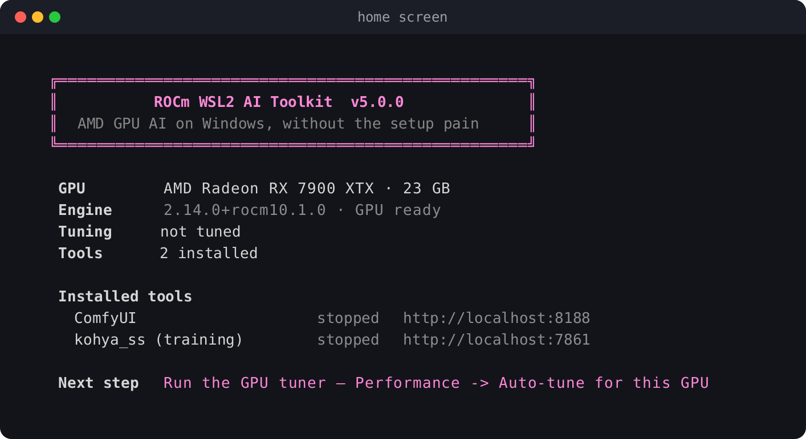
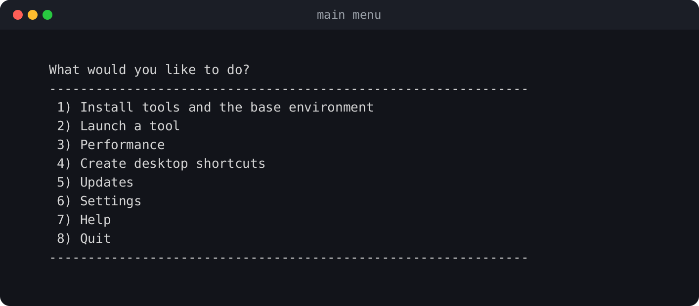
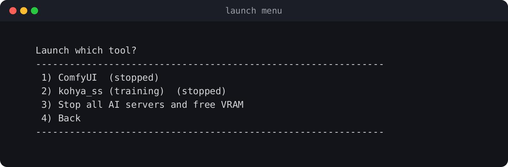
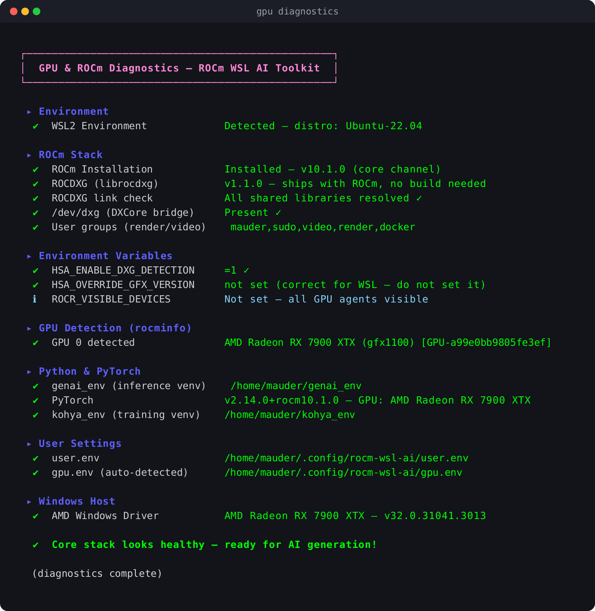

<div align="center">

# ROCm WSL2 AI Toolkit

**Run Stable Diffusion, ComfyUI and local LLMs on an AMD Radeon GPU under WSL2 — measured, not guessed.**

[](https://github.com/daMustermann/rocm-wsl-ai/actions/workflows/ci.yml)
[](https://github.com/daMustermann/rocm-wsl-ai/releases)
[](https://rocm.docs.amd.com/en/docs-10.1.0/)
[](LICENSE)
[](https://learn.microsoft.com/en-us/windows/wsl/install)

</div>

<div align="center">



</div>

---

## What changed in 5.0

ROCm **10.1** is not a version bump — it is a different packaging system. AMD moved
ROCm to a build system called TheRock, and the installer changed shape accordingly:

| | 4.x (ROCm 7.2.x) | 5.0 (ROCm 10.x) |
|---|---|---|
| Packages | `rocm` | `amdrocm10.1-gfx1100` — one per GPU architecture |
| Repository | `repo.radeon.com/rocm/apt/…` | `stable.repo.amd.com/rocm/core/packages/ubuntu2204/` |
| Install root | `/opt/rocm-7.2.4/` | `/opt/rocm/core-10.1/` |
| PyTorch | wheels downloaded by filename | `pip install "torch[device-gfx1100]"` |
| WSL GPU bridge | **built from source** + Windows SDK | **ships inside ROCm**, auto-detected |
| Driver | Adrenalin 26.2.2 | Adrenalin **26.10.41.05** |
| GPU telemetry | `rocm-smi` (removed in 10.x) | `amd-smi` — now works under WSL |

The practical effect: **no Windows SDK, no CMake, no compiling anything.** Five
stages of the old installer simply do not exist any more.

Verified on a real machine — RX 7900 XTX, WSL2 Ubuntu 22.04, Python 3.10:

```
ROCm 10.1.0 (core channel) · librocdxg 1.1.0 · torch 2.14.0+rocm10.1.0
torch.cuda.is_available() = True · AMD Radeon RX 7900 XTX
rocminfo: "WSL environment detected."
```

### Already on 4.x? One command.

```bash
cd ~/rocm-wsl-ai && ./upgrade.sh
```

It discovers what is available, prints a plan, and only then touches anything.
`./upgrade.sh --check` shows the plan and changes nothing.

> **Read this before you upgrade.** ROCm 10.x WSL support is a *technical preview*,
> and AMD requires ROCm 7.2.x to be uninstalled first — the two package trees both
> claim `/opt/rocm`. The upgrade therefore **removes your working 7.2.x stack**, and
> asks you to type `REMOVE` before it does. Your `/opt/rocm-7.2.x` directories are
> renamed, never deleted, so a rollback stays possible. If you would rather stay on
> 7.2.x, use `./upgrade.sh --target legacy` — that path is still maintained.

Full detail: **[docs/UPGRADING.md](docs/UPGRADING.md)**

---

## Why this exists

| The problem | What this does instead |
|---|---|
| ROCm's WSL docs assume you read four pages before installing | One installer that asks the questions for you |
| GPU wheels are version-locked to filenames with git hashes | Versions are discovered from AMD's index at run time |
| `librocdxg` had to be compiled against the Windows SDK | ROCm 10.x ships it; the runtime loads it when `/dev/dxg` exists |
| `torch.cuda.is_available()` returns `False` for hours of debugging | Startup preflight names the cause in one line |
| Upgrades rots until someone edits a script | `./upgrade.sh` migrates 7.2.x → 10.x for you |
| "Performance tips" are folklore copied between forums | The tuner measures on *your* GPU and discards runs that drifted |
| VRAM is held hostage by an idle server | Idle hibernation, then a one-click wake |

---

## Install

**Windows prerequisites** — only one, now:

- Windows 11
- AMD Software: Adrenalin Edition **26.10.41.05 or newer** (for WSL2)
- WSL2 with Ubuntu 22.04, 24.04 or 26.04

Then, inside WSL:

```bash
curl -fsSL https://raw.githubusercontent.com/daMustermann/rocm-wsl-ai/main/install.sh | bash
```

Already have WSL2? `Install_WSL_Ubuntu.bat` sets it up from Windows.

From a clone:

```bash
git clone https://github.com/daMustermann/rocm-wsl-ai.git
cd rocm-wsl-ai && ./install.sh
```

Then run `./menu.sh` and pick **Quick start**.

---

## What you get

<div align="center">

</div>

### A GPU tuner that measures instead of guessing

`./menu.sh → Performance → Auto-tune` runs four shaped workloads on your actual
GPU — convolutions, attention, and a multi-step denoising loop — and keeps the
configuration that genuinely wins. It refuses to declare a winner when the numbers
overlap, and it discards a run whose VRAM or clocks drifted mid-measurement.

Measured on an RX 7900 XTX, ROCm 10.1 / torch 2.14:

| | Cold start | Per-step |
|---|---|---|
| Tuned | 955 ms | 9.0 ms |
| Untuned | 2213 ms | 17.0 ms |

These numbers come from the engine itself; run `./scripts/utils/perf_engine.py bench`
to get your own. See **[docs/PERFORMANCE.md](docs/PERFORMANCE.md)**.

### One launcher for every tool

Every supported tool goes through the same path: environment applied *before*
Python starts, launch flags validated against the tool's own `--help`, a cached
~4 ms preflight, and idle hibernation that frees VRAM when you walk away.

<div align="center">

</div>

| Tool | Repo | Port | venv |
|---|---|---|---|
| ComfyUI | comfyanonymous/ComfyUI | 8188 | `genai_env` |
| SD.Next | vladmandic/sdnext | 7860 | `genai_env` |
| Automatic1111 | AUTOMATIC1111/stable-diffusion-webui | 7860 | `genai_env` |
| kohya_ss | bmaltais/kohya_ss | 7861 | `kohya_env` |
| Text Generation WebUI | oobabooga/text-generation-webui | 5000 | `genai_env` |

Any other git repository can be added from **Install → Add a third-party tool**, or
by appending one line to `~/.config/rocm-wsl-ai/tools.local`.

### Diagnostics that name the cause

<div align="center">

</div>

The single most common support question is *"PyTorch cannot see my GPU"*. This
answers it directly — including the trap that `HSA_OVERRIDE_GFX_VERSION` is
**not** a fallback under WSL but the thing that makes the runtime reject your
device, so the diagnostics now report it as a problem when it is set.

---

## The GPU-visibility trap

Under WSL the GPU is reached through DXCore, not through `/dev/kfd`. ROCr detects
this by looking for `/dev/dxg`, and ROCm 10.x ships the bridge library that does
it. `rocminfo` printing `WSL environment detected.` is the confirmation.

```bash
rocminfo | grep -i wsl          # should say "WSL environment detected."
~/genai_env/bin/python -c "import torch; print(torch.cuda.is_available())"
```

If either fails, run **Settings → GPU Diagnostics**. It checks the driver version,
the DXCore device, the bridge library, group membership, the environment variables
and the venv, in that order, and prints the fix for whichever one is wrong.

---

## Requirements

- **GPU** — RDNA3 / RDNA4 / RDNA4 Radeon, or Ryzen AI. gfx1100 and newer.
  RDNA2 (`gfx1030` and below) is not supported.
- **OS** — WSL2 on Windows 11, with Ubuntu 22.04, 24.04 or 26.04.
- **Driver** — AMD Adrenalin **26.10.41.05+** (for WSL2).
- **Disk** — ~20 GB, plus your models.
- **Python** — 3.10 to 3.14. The installer picks the interpreter that matches your
  Ubuntu release.

Nothing is version-pinned in this repository. ROCm, PyTorch, Triton and the
framework wheels are resolved from AMD's index when you run, so a new ROCm
release works without a code change.

---

## Command reference

| Command | What it does |
|---|---|
| `./menu.sh` | The interactive menu |
| `./menu.sh --demo` | Render every screen once and exit — no prompts |
| `./upgrade.sh --check` | Show the upgrade plan, change nothing |
| `./upgrade.sh` | Upgrade, migrating 7.2.x → 10.x |
| `./upgrade.sh --target legacy` | Stay on the ROCm 7.2.x channel |
| `scripts/utils/gpu_diag.sh` | Full health check |
| `scripts/utils/perf_engine.py bench` | Measure this GPU |
| `scripts/utils/perf_engine.py doctor` | Verify the engine |
| `scripts/utils/capture.sh` | Regenerate the screenshots in `docs/assets` |

### Where your settings live

```
~/.config/rocm-wsl-ai/
├── user.env           your settings (ports, timeouts, GPU target)
├── perf.env           the profile the tuner selected
├── logs/              every upgrade writes a log here
└── cache/             version lookups, 24h TTL
```

---

## Troubleshooting

| Symptom | First thing to try |
|---|---|
| `torch.cuda.is_available()` is `False` | `wsl --shutdown`, then reopen WSL |
| Still `False` | **Settings → GPU Diagnostics** |
| `No matching distribution` while installing | Wrong `device-*` extra — try `torch[device-all]` |
| A tool installs but will not start | **Settings → GPU Diagnostics → Environment Variables** |
| Everything is slow | **Performance → Auto-tune**, then **Show** |
| Upgrade refuses to continue | Type `REMOVE`, or use `--target legacy` |
| `amd-smi event` hangs | Known WSL issue in ROCm 10.1 — do not run it |

Full guide: **[docs/TROUBLESHOOTING.md](docs/TROUBLESHOOTING.md)**

---

## Documentation

| | |
|---|---|
| **[UPGRADING.md](docs/UPGRADING.md)** | 4.x → 5.0, the destructive step, rollback |
| **[ARCHITECTURE.md](docs/ARCHITECTURE.md)** | How the layers fit together |
| **[PERFORMANCE.md](docs/PERFORMANCE.md)** | The tuner's method, and the folklore it rejects |
| **[TROUBLESHOOTING.md](docs/TROUBLESHOOTING.md)** | Symptom-first |
| **[WSL2_SETUP_GUIDE.md](docs/WSL2_SETUP_GUIDE.md)** | Manual, plumbing-level setup |
| **[ADDING_TOOLS.md](docs/ADDING_TOOLS.md)** | Adding a tool to the registry |
| **[CHANGELOG.md](CHANGELOG.md)** | Every release |
| **[CONTRIBUTING.md](CONTRIBUTING.md)** | Checks to run before opening a PR |

---

## Roadmap

- [ ] Per-model VRAM presets
- [ ] MIOpen find-database baking per GPU
- [ ] Shareable performance reports
- [ ] Model browser from inside the menu

---

## Acknowledgements

ROCm and librocdxg are AMD's; PyTorch is the PyTorch Foundation's; ComfyUI,
SD.Next, Automatic1111, kohya_ss and Text Generation WebUI are theirs. The
terminal UI uses [gum](https://charm.sh) by Charm, and is optional — every screen
falls back to plain ANSI when gum is not installed.

## License

MIT — see [LICENSE](LICENSE).